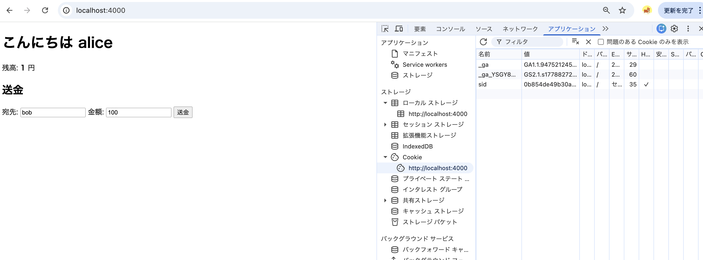
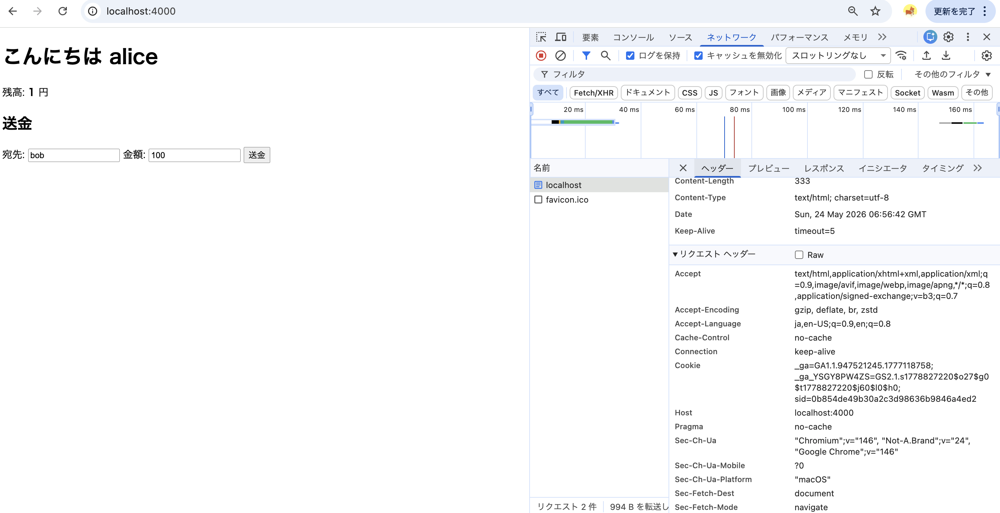

# CSRF (Cross-Site Request Forgery)

## 何が起きる攻撃か

**ログイン中のユーザーが攻撃者のページを開いただけで、本人のつもりがないリクエストが
本人のセッションで実行される。**

CSRF が成立する根本: **ブラウザは、どこのページから飛んだリクエストであれ、
リクエスト先ドメインの Cookie を自動で付ける**。これを悪用する。

---

> **本サンプルの実行環境**: 正規サーバ (`node weak-server.js` on `localhost:4000`) と攻撃者サイト (`python3 -m http.server 8080`) は **どちらも同じ Mac の中のプロセス**。ブラウザから見ると `localhost:4000` と `localhost:8080` で **オリジンが異なるサイト** に見えるので CSRF の構造（クロスオリジンからの POST）は再現できる。本物の別ドメイン（`bank.com` と `evil.com`）構成は別プロジェクトで扱う。

---

## 前提知識

### 0. 時系列で何が起きるか (まずこれ)

教材を最初に動かしたとき、時間順で起きていること:

| 時点 | やること | Cookie の状態 |
|---|---|---|
| T0 | `node weak-server.js` を起動 | まだ何も無し |
| T1 | ブラウザで http://localhost:4000 を開く | サーバーはログイン画面のHTMLを返すだけ。**Cookie はまだ無い** |
| T2 | 「alice としてログイン」ボタンを押す → ブラウザが POST /login をサーバーに送る | まだ無い |
| T3 | サーバーが /login で次の3つを実行:<br>① `sid = ランダム生成`<br>② `sessions.set(sid, {user:'alice', balance:1000})`<br>③ レスポンスに `Set-Cookie: sid=xxx` ヘッダを入れて返す | ヘッダで送られてきた瞬間 |
| **T4** | **ブラウザが `Set-Cookie:` ヘッダを見て、自分のCookie蔵に `sid=xxx` を保存** | **★ ここで初めて Cookie が登録される ★** |
| T5 | ブラウザがサーバーの 302 リダイレクトに従って GET / する | あり |
| T6 | GET / のとき、ブラウザは自動で `Cookie: sid=xxx` をヘッダに付けて送る | あり (自動付与) |
| T7 | サーバーが `getSession(req)` で sid を見て「alice さんだ」と認識し、トップ画面を返す。残高 1000 | あり |
| --- | ↑ ここまで「正規ユーザーがログインしている状態」<br>↓ ここから攻撃。**T7のタブはそのまま開いておく** | |
| T8 | 別ターミナルで `python3 -m http.server 8080` を `csrf/` で起動<br>(攻撃者のサイトを別オリジンとして配信する役割) | あり |
| T9 | ブラウザの **別タブ** で http://localhost:8080/attacker.html を開く | あり (localhost:4000 用なのでこのタブの表示には影響しない) |
| T10 | attacker.html 内の `<script>` が実行され、`<form action="http://localhost:4000/transfer" method="POST">` を自動 submit する | あり |
| **T11** | **ブラウザが POST /transfer を送る。送り先が localhost:4000 なのでCookie蔵から `sid=xxx` を取り出し、Cookie ヘッダに付けて送信** | **★ 攻撃者は sid を知らないが、ブラウザが勝手に付ける ★** |
| T12 | サーバーは Cookie だけ見て「aliceからのリクエスト」と判定し、999円を送金。残高 1 になる | あり |
| T13 | 攻撃者ページの画面は「猫の写真」のまま (form の `target="sink"` で非表示 iframe にレスポンスを流し込んでいる) | あり |
| T14 | (後日でも) 被害者が http://localhost:4000 を開き直すと、残高が 1 円になっていることに気づく | あり |

#### 確認ポイント
- 「いつCookieが登録されたか」= **T4**
- 「攻撃が成立する瞬間」= **T11** (ブラウザがCookieを自動で乗せて送信した瞬間)
- 攻撃者は T11 で送られる sid の値を **知らない・知る必要がない**

以降の節で、それぞれの段階を細かく見ていく。

### 1. 「ログイン」と「Cookie認証(セッション認証)」は別物

通常のサイトでは2段階に分かれている。

**① ログイン (本人確認)**
ユーザーがID/パスワードを送る → サーバーがDBと照合 → 合っていれば本人と認める。
これが本来の「認証」。1回目だけ行う。

**② Cookie認証 (以降のリクエストで「さっきの人だ」と覚える仕組み)**
ログイン成功時にサーバーがやること:

```
sid = ランダム文字列を生成
sessions.set(sid, { user: 'alice', ... })   ← サーバー内のメモに紐付け
Set-Cookie: sid=xxx                          ← ブラウザに付箋を渡す
```

以降、ブラウザがリクエストするたびに `Cookie: sid=xxx` が自動で付く。
サーバーは `sessions.get(sid)` で「この sid は alice さんだ」と思い出す。
**毎回パスワードを聞かなくて済むようにする仕組み** が Cookie認証 (セッション認証とも言う)。

CSRFが攻撃するのは ② の仕組み。「Cookieだけで本人判定する」が落とし穴になる。

### 2. 教材のサーバーは ① を省略している

> **このセクションの目的:** ソースを見たときに「あれ、パスワードチェックがどこにもない、
> 壊れているのか?」と思わないようにするための注記。教材として **わざと簡略化している** ことと、
> その結果「ボタンを押す = sid が発行される」という妙に乱暴な挙動になっている理由を説明する。
> 本物のサイトはこうではない、と理解した上で以降の Cookie 認証の話に進むため。

`weak-server.js` の `/login` はパスワード照合を **やっていない**:

```js
if (req.method === 'POST' && req.url === '/login') {
  const sid = crypto.randomBytes(16).toString('hex');
  sessions.set(sid, { user: 'alice', balance: 1000 });  // ← パスワードチェック無し
  res.setHeader('Set-Cookie', `sid=${sid}; HttpOnly; Path=/`);
  ...
}
```

「alice としてログイン」ボタンを押すと **無条件に alice 扱い** になり、sid が発行される。
本来あるべきパスワード確認は省略している (CSRFを教えるのが目的のため)。

つまり教材における「ログイン」の正体は:

> ボタンを押す → サーバーが何の確認もせず sid を発行して Cookie に入れる
> → 以降、その sid を持っているブラウザはサーバーから見ると alice

### 2-2. Cookie認証は「発行」と「照合」の2か所に分かれている

`/login` は **IDカードを発行して渡すだけ**。実際の「Cookie認証(=本人判定)」は別の場所。

**発行側 (/login)**

```js
const sid = crypto.randomBytes(16).toString('hex');           // ランダムID生成
sessions.set(sid, { user: 'alice', balance: 1000 });          // サーバー側で sid → alice の対応を記録
res.setHeader('Set-Cookie', `sid=${sid}; HttpOnly; Path=/`);  // ブラウザに sid を渡す
```

**照合側 (getSession)**

```js
function parseCookies(req) {
  return Object.fromEntries(
    (req.headers.cookie || '')
      .split(';')
      .map(s => s.trim().split('='))
      .filter(p => p[0])
  );
}
const getSession = req => sessions.get(parseCookies(req).sid);   // ★ ここがCookie認証本体
```

この関数がやっていること:
1. リクエストヘッダから `Cookie: sid=xxx` を取り出す
2. `xxx` をキーに `sessions` Map を引く
3. 該当するセッションオブジェクト (`{user:'alice', balance:1000}`) を返す

**呼び出し側 (各ハンドラの先頭)**

```js
// /transfer の先頭
const sess = getSession(req);                       // ★ Cookie認証が走る
if (!sess) { res.writeHead(401); return res.end('not logged in'); }
// ...以降は alice として処理される
sess.balance -= amount;
```

トップページの GET でも同じく `getSession(req)` を呼んで、ログイン中か未ログインかで
画面を出し分けている。

#### まとめ図

```
[/login]   ← IDカード(sid)を発行して渡す。本人判定はしていない
   ↓ Set-Cookie で sid をブラウザに保存

   (以降のリクエスト)
   ↓ ブラウザが Cookie: sid=xxx を自動付与

[/ や /transfer] → getSession(req) → sessions.get(sid)   ★ ここでCookie認証
                                                          → 「あ、alice さんね」
```

CSRFが攻撃しているのは **照合側 (getSession)** 。
「Cookieのsidだけ見て本人判定する」という単純さが弱点なので、
リクエストの出所(正規ページか攻撃者ページか)を確認していない。

### 3. Cookie とは何か (実体)

**サーバーがブラウザに「これを覚えておいて。次から毎回送ってきて」と渡す小さな付箋。**

- ログイン時にサーバーが `Set-Cookie:` ヘッダで送る
- ブラウザは **ドメインごと** に保管 (例: localhost 用)
- 以降、そのドメインに何かリクエストするたびに **ブラウザが自動で付ける**
- 「どのページから飛んだか」は判断材料にしない (←★ここが CSRF の根本)

### 4. 「他サイト」「別オリジン」「別ドメイン」の違い

README で「他サイト」「別オリジン」と書いている用語の厳密な意味。

| 用語 | 範囲 | 例 |
|---|---|---|
| **ドメイン** | ホスト名だけ | `localhost`, `example.com` |
| **ポート** | 通信窓口の番号 | `4000`, `8080`, `443` |
| **オリジン** | スキーム + ホスト + ポートの組 | `http://localhost:4000` |

`http://localhost:4000` と `http://localhost:8080` は:

- ドメイン: **同じ** (`localhost`)
- ポート: **違う**
- オリジン: **違う**

ブラウザのセキュリティ (Same-Origin Policy) は **オリジン** を見る。
だからこの教材で「他サイトから」「別オリジンから」と書いているのは
ポート違いを指している。

#### ただし Cookie だけ事情が違う

Cookie は **ドメイン単位** で管理される。**ポートを区別しない**。

```
Set-Cookie: sid=xxx; HttpOnly; Path=/
                     ↑ Domain属性なし → 「ホスト名(localhost)」に紐付く
```

ブラウザの Cookie 蔵:

```
[localhost]  sid=xxx   (← :4000 とも :8080 とも書かれていない)
```

結果として:
- `localhost:4000` 宛のリクエスト → 付く
- `localhost:8080` 宛のリクエスト → 付く (同じ `localhost` だから)

#### オリジンの構成要素 (スキーム・ホスト・ポート)

```
http://localhost:4000
└┬─┘   └───┬───┘ └┬─┘
スキーム  ホスト   ポート
```

| 部品 | 何 | 例 |
|---|---|---|
| **スキーム** | 通信プロトコルの種類 | `http`, `https`, `ws`, `file` |
| **ホスト** | サーバーを指す名前 (ドメイン or IP) | `localhost`, `example.com`, `192.168.0.1` |
| **ポート** | サーバーの中の窓口番号 | `4000`, `443`, `80` |

この3つが **全部一致** したときだけ「同じオリジン」。1つでも違えば「別オリジン」。

| URL 1 | URL 2 | 関係 |
|---|---|---|
| `http://example.com` | `https://example.com` | 別オリジン (スキームが違う) |
| `http://example.com` | `http://api.example.com` | 別オリジン (ホストが違う) |
| `http://example.com:80` | `http://example.com:8080` | 別オリジン (ポートが違う) |
| `http://example.com` | `http://example.com/about` | **同じ**オリジン (パス違いはオリジンではない) |

#### 教材と本番の対応

| | 教材 | 本番 |
|---|---|---|
| 攻撃者 | `http://localhost:8080` | `https://attacker.com` |
| 標的 | `http://localhost:4000` | `https://bank.com` |
| Same-Origin Policy 上の関係 | 別オリジン (ポートが違う) | 別オリジン (ホストが違う) |
| ブラウザの扱い | 「他サイト」 | 「他サイト」 |

仕組みとしては同じ:
- 送り元と送り先がオリジンとして異なる
- でも送り先ドメインの Cookie がブラウザ蔵にある
- → ブラウザは Cookie を自動で付ける
- → サーバーは本人と誤認する

教材でポート違いを使っているのは「localhost で完結させるため」の都合。
**ブラウザ的には「ポートが違うか / ホストが違うか」は関係なく、別オリジンなら別サイト** として
処理するので、本番の別ドメイン攻撃と論理は同じ。

実際、本番でもポート違いを利用した攻撃は成立する。例: 社内システムで `http://internal:3000`
と `http://internal:3001` が動いていて、片方が脆弱だと、もう片方から CSRF されうる。
防御方法も同じ (CSRFトークン、SameSite)。

---

## 手順

### Step 1. 弱いサーバーを起動 (銀行サイト想定)

```bash
node weak-server.js
# → weak target: http://localhost:4000
```

### Step 2. ログインして残高を確認

ブラウザで http://localhost:4000 を開き、「alice としてログイン」を押す。
残高 1000 円が表示される。

### Step 3. Cookie (`sid`) がブラウザに保存されたのを確認する 🍪

DevTools (Cmd+Opt+I) を開く → **アプリケーション** タブ → 左メニューの
**ストレージ → Cookie → http://localhost:4000** をクリック。

下記のように `sid` という Cookie が登録されているのが見える:



- 名前: `sid`
- 値: `0b854de49b30a...` (ランダム文字列)
- ドメイン: `localhost`

これが **「あなたがalice本人である」というブラウザに渡された証明書**。
weak-server.js の `crypto.randomBytes(16).toString('hex')` で生成された文字列。
サーバー側では `sessions` Map にこの値がキーとして保存されていて、
中身は `{ user: 'alice', balance: 1000 }`。

### Step 4. Cookie が自動送信されるのを確認する

DevTools → **ネットワーク** タブを開く。最初はこんな状態:



(まだリクエスト履歴は無く、「ページを再読み込み」と促されている)

ここで次の2手をやる:

1. 上のフィルタを **「すべて」** に切り替える (今 `Fetch/XHR` だと HTML のリクエストが除外される)
2. ページを **リロード** (Cmd+R)

リクエスト一覧の一番上に `localhost` が出るのでクリック →
右側の **ヘッダー** タブ → 下にスクロール → **リクエストヘッダー** の見出しの中に:

```
Cookie: sid=0b854de49b30a...
```

これが「ブラウザが Step 3 の Cookie を、リクエストに勝手に乗せてサーバーに送った」事実。
**正規にalice本人がページを開いたから付いている**、ように見えるが、実はブラウザは
誰がページを開いたかなど見ていない。送り先が localhost:4000 なら付けるだけ。
この性質を次に攻撃者が利用する。

### Step 5. 攻撃者サイトを別ポートで配信

別ターミナルで `02-app/csrf/` に入って:

```bash
python3 -m http.server 8080
```

(別オリジンであることが本質なので、別ポート HTTP で開く)

### Step 6. 攻撃者サイトを開く

http://localhost:8080/attacker.html を開く。
表向きは「かわいい猫の写真集」だけ。**裏で `<form>` が
http://localhost:4000/transfer に自動 POST されている**。

ここで Step 4 の話が効いてくる:
- form の送り先は `http://localhost:4000/transfer`
- ブラウザは「送り先が localhost:4000 → Cookie蔵に `sid` がある → 自動で付ける」
- サーバーから見ると Step 4 と全く同じ Cookie 付きリクエスト
- サーバーは Cookie だけ見て alice と判定し、送金処理を実行

### Step 7. 銀行サイトに戻って残高を確認

http://localhost:4000 をリロードすると、**残高が `1000 - 999 = 1` になっている**。
ユーザーは「猫の写真ページ」を見ていただけ。これが CSRF。

> 攻撃者ページ側は「猫の写真集」のまま画面が変わらない。これは form の `target="sink"`
> で非表示 iframe にレスポンスを流し込んでいるため。
> もし `target` を外すと送信後にレスポンス画面に遷移してしまい、ユーザーに気づかれる。
> 現実の攻撃者は気づかれたくないので必ず iframe や fetch を使う。

---

## よくある誤解: 攻撃者は `sid` を知っているのか?

**いいえ。知りません。そして知る必要がありません。** ここがCSRFの一番の急所。

### 攻撃者が事前に調べていること (公開情報)

| 何を | どうやって |
|---|---|
| 送金APIのURL (`/transfer`) | 自分が標的サイトにログインしてフォームのHTMLソースを見ればよい |
| パラメータ名 (`to`, `amount`) | 同上 |
| HTTPメソッド (POST) | 同上 |

→ これらは **「悪意なくユーザーとして使うだけ」で全部丸見え**。隠せない情報。

### 攻撃者が **知らない / 知る必要がない** こと

| 何を | なぜ知らなくていいか |
|---|---|
| 被害者の `sid` の値 | 自分のサーバーから読めない (他オリジンの Cookie は Same-Origin Policy で隔離されている) |
| 被害者のパスワード | そもそも Cookie 認証なので不要 |
| 被害者が誰か | 攻撃者は「ばらまく」だけ。踏んだ人のCookieで処理される |

### なぜ sid なしで攻撃が通るのか (再確認)

```
攻撃者ページが標的サイトへ POST する
       ↓
ブラウザ「送り先が localhost:4000 だな」
       ↓
ブラウザのCookie蔵に localhost:4000 用の sid がある (Step 3 で確認したやつ)
       ↓
ブラウザが勝手に Cookie: sid=xxx を付けて送信
       ↓
サーバーは「これは alice のセッション」と認識して処理
```

★ 攻撃者は `sid` を **見ても触ってもいない**。被害者のブラウザが勝手に付けて、
サーバーが勝手に信用しただけ。

「Cookie認証だけで識別する」=「**そのドメイン宛なら誰の指示でも本人の操作とみなす**」
ということ。これがCSRFが成立する根本理由。

---

## 攻撃者はどうやってユーザーに開かせるのか

教材ではあなた自身が `http://localhost:8080/attacker.html` をURL欄に打ちました。
現実ではそういう開き方はしません。代表的な誘導手段:

| 手段 | 例 |
|---|---|
| フィッシングメール | 「Amazonからの重要なお知らせ」を装って `https://amaz0n-info.com/check` を踏ませる |
| SNS・チャットのリンク | LINE / X / Discord で「面白い動画見つけた」と短縮URLを送る |
| 掲示板・コメント欄 | ブログコメントや 5ch にリンクを貼る |
| マルバタイジング | 広告ネットワークに悪意あるバナーを紛れ込ませる |
| 正規サイトの改ざん | ニュースサイト等にXSSで `<iframe src="attacker.html">` を仕込む |
| SEOポイズニング | 「楽天 ログイン」検索で上位に出るよう仕込む |
| QRコード | 駅・カフェ等の貼り紙の QR を差し替える |

### 成立条件

- 被害者がそのとき標的サイトに **ログイン中** (= ブラウザに Cookie が残っている)
- 攻撃者ページのリンクを **1回踏ませる** だけでよい

多くのサイトはログイン状態を数日〜数週間保つので、攻撃者には十分な時間がある。

### 被害者の体感

「友達から送られた猫動画のリンクを開いた」だけ。
標的サイトの画面は一度も見ていない。
でも気づいたら銀行残高が減っている。これがCSRF被害の現実。

---

## 攻撃の流れを図で

```
[ブラウザ]
   ├─ Cookie 保存: sid=xxx (localhost:4000 用)
   │
   ├─ localhost:8080/attacker.html を開く
   │    └─ <form action="http://localhost:4000/transfer" method=POST> を自動送信
   │         ↓
   │    POST http://localhost:4000/transfer
   │    Cookie: sid=xxx   ← ★ブラウザが自動付与
   │    Body: to=attacker&amount=999
   │         ↓
[サーバー(weak)]
   ├─ Cookie 見て alice と認識
   ├─ 検証なしで送金実行
   └─ 残高: 1
```

---

## 直したコード

```bash
# weak-server を Ctrl+C で止める
node fixed-server.js
```

ブラウザの Cookie を一度クリアしてから (`応用` → `ストレージ` → `localhost:4000`
の Cookie を削除)、もう一度ログイン → 攻撃者ページを開く。

今度は送金されず、サーバー側に `403 CSRF token mismatch` が出る。

### 何を直したか (2点)

1. **CSRF トークン**
   - サーバーがログイン時にランダムなトークンを発行・セッションに保存
   - 正規のフォームには `<input type="hidden" name="csrf" value="...">` を埋め込む
   - POST 時にトークンが一致するかサーバーで検証
   - 攻撃者は他オリジンからトークンを取得できない (Same-Origin Policy)

2. **`SameSite=Strict` Cookie**
   - 「他サイトから来たリクエストには Cookie を送らない」とブラウザに指示
   - 攻撃者サイトから POST しても、そもそも Cookie が付かない → ログイン扱いされない

両方やる (defense in depth)。

---

## 補足: 現代ブラウザの SameSite デフォルト

Chrome / Firefox / Safari は最近、Cookie に `SameSite` を明示しないと
**デフォルトで Lax** として扱う。Lax は「他サイトからの POST には Cookie を付けない」
ので、上記の form 自動 submit 攻撃は実は **何もしなくてもブラウザが弾く** ことが多い。

つまり手順 5 で残高が変わらなかったら、それは **ブラウザのデフォルト保護が効いている**。
ただし:

- すべてのユーザーが新しいブラウザを使うとは限らない
- Lax は「トップレベルの GET ナビゲーション」は通す → GET で状態変更してる API は危険
- SameSite だけに頼らず、必ずトークン検証も入れる

それでもブラウザで攻撃を再現したい場合は、curl で同じことができる:

```bash
# 1. ログイン Cookie を取得
curl -i -X POST http://localhost:4000/login -c cookies.txt

# 2. その Cookie を使って /transfer を叩く (= 攻撃者サイトからの POST 相当)
curl -X POST http://localhost:4000/transfer \
  -b cookies.txt \
  -d 'to=attacker&amount=999'

# 3. 残高確認
curl http://localhost:4000 -b cookies.txt | grep 残高
```

`fixed-server.js` で同じ手順を踏むと、`/transfer` が **403 CSRF token mismatch** を返す。

---

## こうしておけば守れた、の整理

| 対策 | 何をしているか |
|---|---|
| **CSRF トークン** (今回の修正) | フォームに使い捨て秘密値を埋め込み、サーバーで検証 |
| **`SameSite=Strict` / `Lax` Cookie** | ブラウザレベルで他サイトからの Cookie 自動付与を止める |
| **Origin / Referer ヘッダ検証** | サーバーで「リクエスト元が自サイトか」確認 |
| **状態変更は GET でやらない** | `` 系の攻撃を成立させない |
| **Custom Header の要求** | `X-Requested-With` のような独自ヘッダ必須にすると、cross-origin だと preflight が走るので防げる |

実運用では Express の `csurf`、Django の ``、Rails の
`protect_from_forgery` など、フレームワークが用意した仕組みを使うのが普通。
ゼロから自前で書くものではない。
